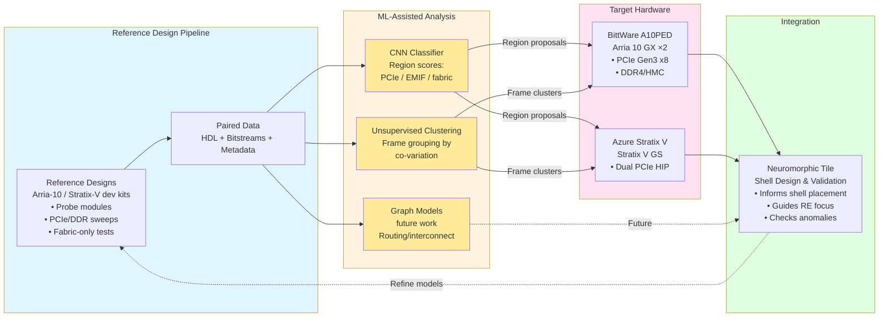
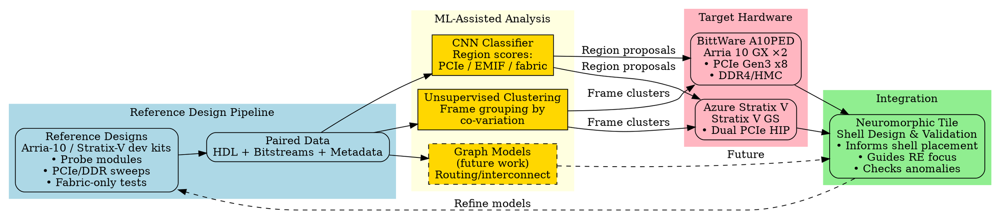

# Figure Specification: ML-Assisted Bitstream Analysis Flow

**Figure X: ML-assisted bitstream analysis pipeline for Arria 10 and Stratix V tiles**

## Mermaid Diagram



## Graphviz DOT Format



## TikZ (LaTeX) Format

```latex
\begin{tikzpicture}[
    node distance=2cm,
    box/.style={rectangle, draw, rounded corners, minimum width=3cm, minimum height=1.5cm, text width=3cm, align=center},
    mlbox/.style={box, fill=yellow!30},
    refbox/.style={box, fill=blue!10},
    targetbox/.style={box, fill=pink!20},
    integbox/.style={box, fill=green!10}
]

% Reference designs
\node[refbox] (ref) {Reference Designs\\Arria-10 / Stratix-V\\• Probe modules\\• PCIe/DDR sweeps};
\node[refbox, right=of ref] (data) {Paired Data\\HDL + Bitstreams\\+ Metadata};

% ML analysis
\node[mlbox, right=of data, yshift=1.5cm] (cnn) {CNN Classifier\\Region scores\\PCIe / EMIF / fabric};
\node[mlbox, right=of data] (cluster) {Unsupervised\\Clustering\\Frame grouping};
\node[mlbox, right=of data, yshift=-1.5cm] (graph) {Graph Models\\(future)\\Routing};

% Target hardware
\node[targetbox, right=of cnn, yshift=1cm] (a10ped) {BittWare A10PED\\Arria 10 GX ×2\\• PCIe Gen3 x8\\• DDR4/HMC};
\node[targetbox, right=of cluster, yshift=-1cm] (azure) {Azure Stratix V\\Stratix V GS\\• Dual PCIe HIP};

% Integration
\node[integbox, right=5cm of cluster] (shell) {Neuromorphic Tile\\Shell Design\\& Validation};

% Arrows
\draw[->] (ref) -- (data);
\draw[->] (data) -- (cnn);
\draw[->] (data) -- (cluster);
\draw[->] (data) -- (graph);
\draw[->, thick] (cnn) -- node[above] {Region proposals} (a10ped);
\draw[->, thick] (cnn) -- (azure);
\draw[->, thick] (cluster) -- node[below] {Frame clusters} (a10ped);
\draw[->, thick] (cluster) -- (azure);
\draw[->, dashed] (graph) -- node[below] {Future} (shell);
\draw[->] (a10ped) -- (shell);
\draw[->] (azure) -- (shell);
\draw[->, dashed, bend left=60] (shell) to node[above] {Refine models} (ref);

\end{tikzpicture}
```

## ASCII Art Version (for quick reference)

```
┌─────────────────┐      ┌──────────────────┐
│ Ref Designs     │─────▶│  Paired Data     │
│ A10/SV dev kits │      │  HDL+bitstreams  │
│ • Probe modules │      └──────────────────┘
│ • PCIe/DDR      │              │
└─────────────────┘              │
                                 │
                    ┌────────────┼────────────┐
                    ▼            ▼            ▼
              ┌──────────┐ ┌──────────┐ ┌──────────┐
              │   CNN    │ │ Cluster  │ │  Graph   │
              │Classifier│ │  Frames  │ │  Models  │
              │          │ │          │ │ (future) │
              └──────────┘ └──────────┘ └──────────┘
                    │            │            │
          ┌─────────┴────────────┴────┐       │
          ▼                           ▼       │
    ┌──────────┐              ┌──────────┐   │
    │ A10PED   │              │  Azure   │   │
    │ (A10 GX) │              │ Strat-V  │   │
    │• PCIe x8 │              │• PCIe HIP│   │
    └──────────┘              └──────────┘   │
          │                           │       │
          └─────────────┬─────────────┘       │
                        ▼                     │
              ┌──────────────────┐            │
              │ Neuromorphic     │◀───────────┘
              │ Tile Shell       │
              │ Design &         │
              │ Validation       │
              └──────────────────┘
                        │
                        │ Refine models
                        │ (feedback)
                        ▼
                  (back to ref)
```

## Figure Caption (for paper)

**Figure X: ML-assisted bitstream analysis pipeline for Arria 10 and Stratix V neuromorphic tiles.**

This workflow shows how machine learning accelerates reverse engineering of legacy FPGA accelerator cards. (Left) Reference designs on supported development boards generate paired HDL and bitstream datasets with known ground truth. (Center) Three ML techniques extract patterns: CNN classifiers identify probable PCIe/memory/fabric regions, unsupervised clustering groups frames by functional co-variation, and graph-based models (future work) may recover interconnect structure. (Right) These models analyze bitstreams from target boards—BittWare A10PED (dual Arria 10 GX) and Azure Stratix V cards—producing region proposals and frame clusters that guide manual RE. (Bottom) Insights inform neuromorphic tile shell design, validate placements, and identify anomalies. A feedback loop (dashed arrow) enables iterative refinement: new experiments on reference boards improve model accuracy. Importantly, this approach provides *priors and guidance* for human analysis rather than automatic decryption or IP recovery, and is bounded by encryption (only works on unencrypted bitstreams or self-compiled designs) and ethical constraints (educational/research use of decommissioned hardware only).

## Notes for Implementation

### Color Scheme Recommendations
- **Reference pipeline (blue)**: #e1f5ff
- **ML analysis (yellow)**: #fff4e1
- **Target hardware (pink)**: #ffe1f0
- **Integration (green)**: #e1ffe1
- **ML submodules (gold)**: #ffeb99

### Icons to Include
- FPGA board icons for A10PED and Azure cards
- Heatmap visualization for CNN output
- Cluster dots for unsupervised learning
- Graph network nodes for future GNN work
- Bitstream waveform/binary patterns

### Size Recommendations
- Full width figure (spanning two columns if applicable)
- High resolution for zooming (vector format preferred)
- Clear labels readable at typical paper viewing size
